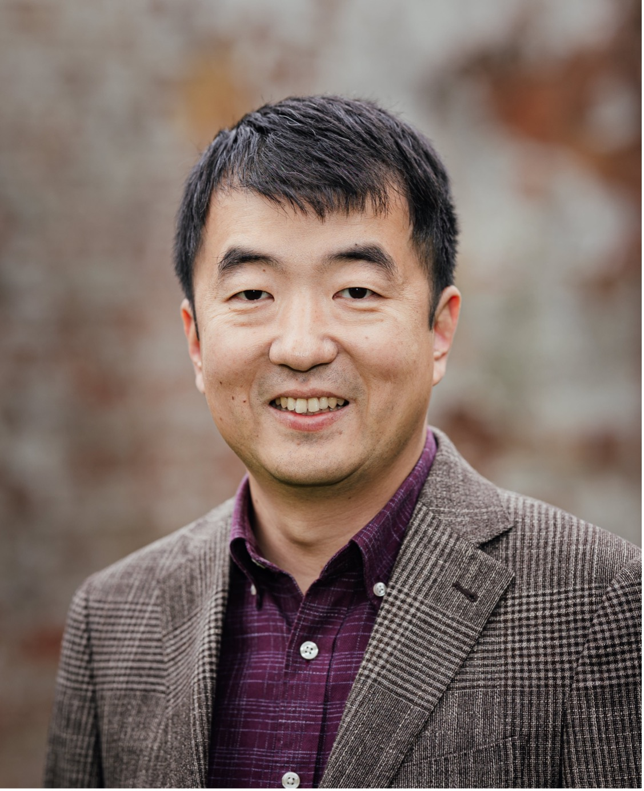

## About Me

Dr. Meng Wang is a Reader in the Department of Computer Science, with research interests in programming languages and software engineering. He leads the [*Programming Languages Research Group at Bristol*](https://bristolpl.github.io) and is a member of [*IFIP Working Group 2.1 on Algorithmic Languages and Calculi*](https://ifipwg21wiki.cs.kuleuven.be/IFIP21/WebHome). He is the International Director of [*School of Computer Science, Electrical and Electronic Engineering, and Engineering Maths*](https://www.bristol.ac.uk/engineering/school-sceem/), and a member of the school management team and school board.

Previously, he was a lecturer at University of Kent, and an assistant professor at Chalmers University of Technology. He completed his DPhil (known as PhD elsewhere) at University of Oxford, and before that he studied at National University of Singapore.

## Research Interest

The central theme of his research is to apply theoretical rigour to practical programming, with the aim of improving the correctness and robustness of software systems. In particular, he focuses on designing languages and tools for software development and testing.

#### Research keywords

* Programming Languages
* Functional Programming
* [*Bidirectional Programming*](https://bx-lang.github.io/EXHIBIT/intro.html)
* Software Engineering
* Testing

**I am looking for motivated PhD students and PostDocs. Please get in touch if you are interested.**

## News

Oct, 2022
: [Exploring Better Black-Box Test Case Prioritization via Log Analysis](./Papers/TOSEM22.pdf) is accepted by ACM Transactions on Software Engineering and Methodology. 

Sep, 2022
: Roly Perera has joint the group as a research fellow, and Joe Bond and Cameron Low as research associates. Welcome!

May, 2022
: [Modular Probabilistic Models via Algebraic Effects](./Papers/ICFP22.pdf) is accepted by ICFP'21.

Dec, 2021
: Funding success! *Ownership and Lifetime Driven Synthesizer for Automatic C to Rust Translation* is funded by Huawei Ireland.

Sep, 2021
: Two papers [Staging with Class](./Papers/POPL22a.pdf) and [Linked visualisations via Galois dependencies](./Papers/POPL22b.pdf) are accepted by POPL'22.

Sep, 2021
: [Synbit: Synthesizing Bidirectional Programs using Unidirectional Sketches](./Papers/oopsla21.pdf) is accepted by OOPSLA'21.

Aug, 2021
: My student [Minh Nguyen](https://min-nguyen.github.io) won the first place at the ACM Student Research Competition (ICFP) with *Composable, Modular Probabilistic Models*. Congratulations Minh!

June, 2021
: I am chairing the [Bx workshop](http://bx-community.wikidot.com/bx2021:home) with Leen Lambers.

June, 2021
: Hanliang Zhang joins the team as a research assistant on the Rust project.

Feb, 2021
: Funding success! *Verified Program Synthesis for Refactoring Rust Programs* is funded by the National Cyber Security Centre (NCSC).

Jan, 2021
: [Ningning Xie](https://xnning.github.io/) from University of Hongkong is visiting us for four months. Welcome Ningning!

Dec, 2020
: [Weixin Zhang](https://wxzh.github.io/) joins the team as a senior research associate on the [*EXHIBIT*](https://gow.epsrc.ukri.org/NGBOViewGrant.aspx?GrantRef=EP/T008911/1) project. Welcome Weixin!

Jun, 2020
: I am very glad to be nominated for *Inspiring and Innovative Teaching Award* at Bristol for my Functional Programming unit. I had a lot of fun and it seems that the students did too!

May, 2020
: [*Sparcl: A Language for Partially-Invertible Computation*](./Papers/ICFP20.pdf) is (unconditionally) accepted by ICFP'20.

Mar 2020
: Project *Making Software Development Language-Agnostic through Cross-Language Mapping and Migration* funded by the Royal Society (IES\R3\193175).

Dec, 2019
: I am co-chairing the Ninth International Workshop on Bidirectional Transformations ([BX 2020](http://bx-community.wikidot.com/bx2020:home)). Deadline for papers is 4 May 2020.

Nov, 2019
: Three PhD students (Samantha Frohlich, Minh Nguyen, and Anton Antich) are starting in early 2020. Welcome!

Oct, 2019
: [*A Study of Programming Languages and Their Bug Resolution Characteristics*](./Papers/TSE19.pdf) is accepted by Transactions on Software Engineering (TSE).

Sep 2019
: Project [*EXHIBIT : Expressive High-Level Languages for Bidirectional Transformations*](https://gow.epsrc.ukri.org/NGBOViewGrant.aspx?GrantRef=EP/T008911/1) funded by EPSRC (EP/T008911/1).

Sep 2019
: Dr Kazutaka Matsuda from Tohoku University is visiting for two weeks.

Aug 2019
: Samantha Frohlich won the first prize of ICFP 2019 Student Research Competition (Undergraduate Category). Well done Sam!

---

