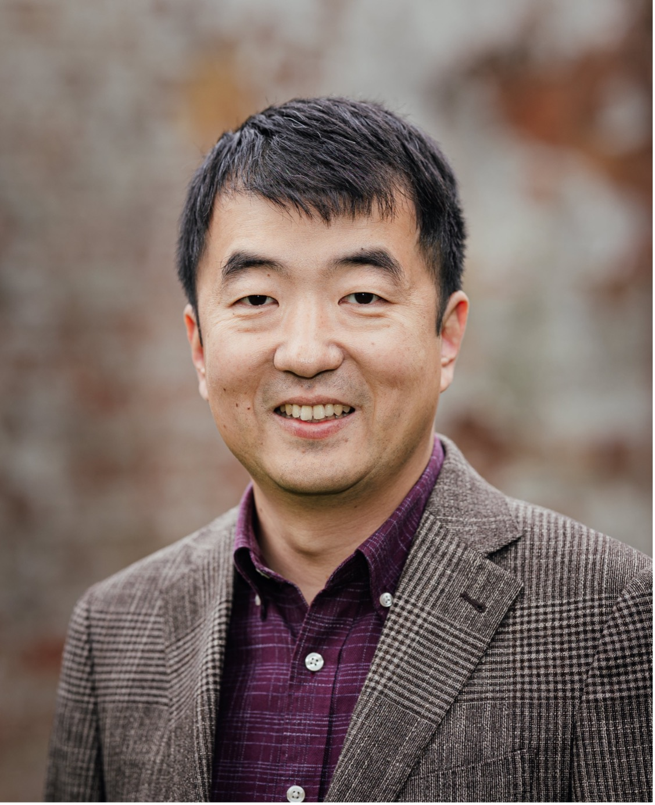

## About Me

Dr. Meng Wang is a Senior Lecturer in the Department of Computer Science, with research interests in programming languages and software engineering. Previously, he was a lecturer at University of Kent, and an assistant professor at Chalmers University of Technology. He completed his DPhil (known as PhD elsewhere) at University of Oxford, and before that he studied at National University of Singapore.

## Research Interest

The central theme of his research is to apply theoretical rigour to practical programming, with the aim of improving the correctness and robustness of software systems. In particular, he focuses on designing languages and tools for software development and testing.

#### Research keywords

* Programming Languages
* Functional Programming
* Bidirectional Programming
* Software Engineering
* Testing

**I am looking for motivated PhD students and PostDocs. Please get in touch if you are interested.**

#### Projects

- [EXHIBIT](https://mengwangoxf.github.io/EXHIBIT)

## News
Mar 2020 
: Project *Making Software Development Language-Agnostic through Cross-Language Mapping and Migration* funded by the Royal Society (IES\R3\193175). 

Dec, 2019
: I am co-chairing the Ninth International Workshop on Bidirectional Transformations ([BX 2020](http://bx-community.wikidot.com/bx2020:home)). Deadline for papers is 4 May 2020. 

Nov, 2019
: Three PhD students (Samantha Frohlich, Minh Nguyen, and Anton Antich) are starting in early 2020. Welcome! 

Oct, 2019 
: [*A Study of Programming Languages and Their Bug Resolution Characteristics*](./Papers/TSE19.pdf) is accepted by Transactions on Software Engineering (TSE).

Sep 2019 
: Project [*EXHIBIT : Expressive High-Level Languages for Bidirectional Transformations*](https://gow.epsrc.ukri.org/NGBOViewGrant.aspx?GrantRef=EP/T008911/1) funded by EPSRC (EP/T008911/1). 

Sep 2019 
: Dr Kazutaka Matsuda from Tohoku University is visiting for two weeks.   

Aug 2019 
: Samantha Frohlich won the first prize of ICFP 2019 Student Research Competition (Undergraduate Category). Well done Sam!

---

